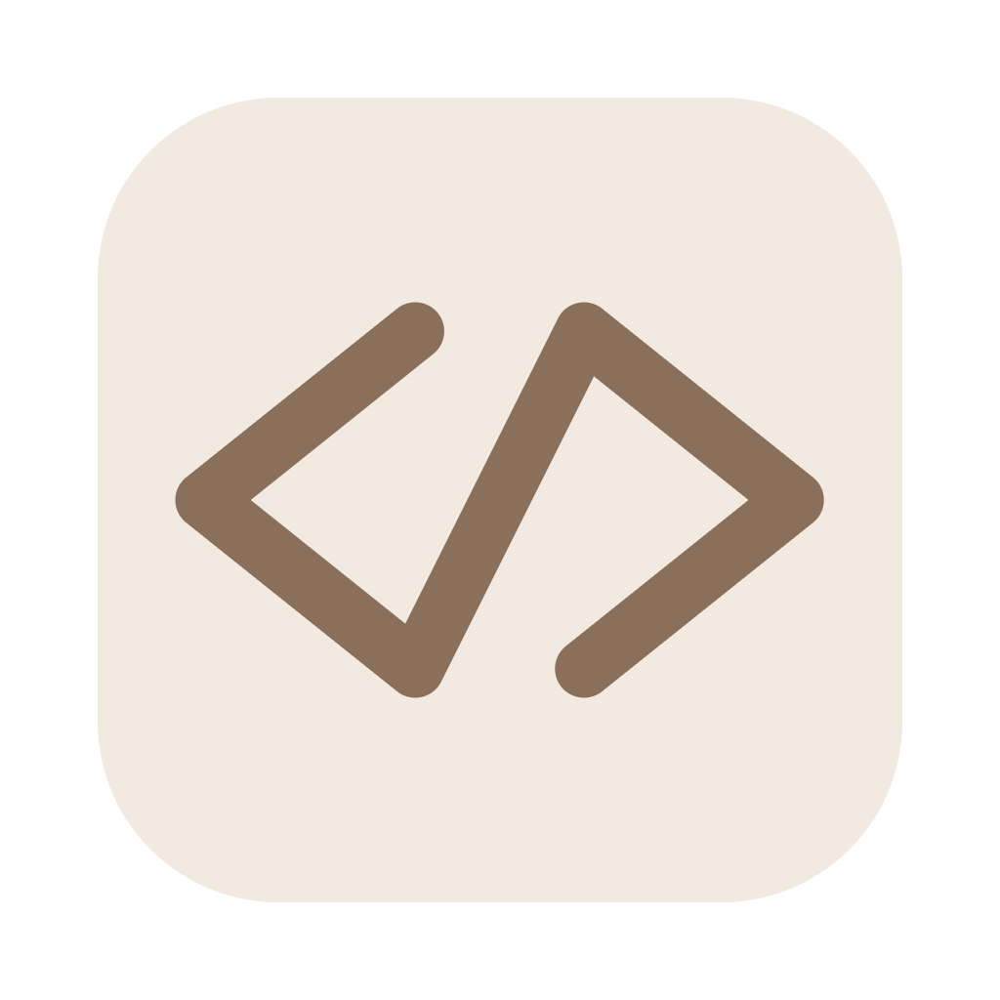

<div align="center">



# TACode

**A local-first AI coding workbench built on the Pi ecosystem**

Let DeepSeek and OpenAI-compatible models inspect, edit, and verify your repositories with explicit safety boundaries.

[English](README.md) · [简体中文](README.zh-CN.md) · [Download latest](https://github.com/tt-11-dd/tether-ai/releases/latest)

[](LICENSE)
[](https://github.com/tt-11-dd/tether-ai/releases/latest)

</div>on desktop agent for real codebases. It brings model calls, workspace tools, terminal commands, permission prompts, session history, and diff review into one local workbench. The UI and session data stay on your machine; model requests go directly to the provider or local gateway you configure, without a TACode relay.

## Why TACode

- **DeepSeek first** — custom Base URL, model discovery, and reasoning-level controls, plus OpenAI-compatible endpoints such as OneAPI, Ollama, and vLLM.
- **Visible and controllable** — inspect tool calls, command output, file changes, and context usage as work happens.
- **Permission boundaries** — Plan, Ask, Workspace, and Full Access modes.
- **Recoverable edits** — patch checkpoints let `/undo` restore the previous turn's file changes.
- **Local-first state** — settings, credentials, and sessions live under `~/.tether`; no telemetry or TACode-hosted model proxy.
- **Desktop workflow** — project threads, `@` file mentions, steer-while-generating, image input, themes (white / paper / dark), diff previews, and Chinese/English UI.

## What TACode uses from Pi

TACode does not reimplement the agent foundations. It depends on the [Pi ecosystem](https://github.com/earendil-works/pi) directly and owns its runtime layer in [`src/runtime`](src/runtime):

| Pi package | Used by TACode for |
| --- | --- |
| `@earendil-works/pi-agent-core` | Agent state, message streams, tool calls, and thinking-level types |
| `@earendil-works/pi-ai` | Model/provider contracts, message/image/usage types, and OpenAI API foundations |
| `@earendil-works/pi-coding-agent` | Coding-agent extensions, sessions/settings, project trust, and RPC client/worker |
| `@earendil-works/pi-tui` | Text components, themes, and terminal interaction used by the Runtime CLI |

TACode adds:

- DeepSeek defaults and an OpenAI-compatible gateway workflow
- Four permission modes, macOS Seatbelt, and an experimental Windows sandbox helper (install + enable)
- Workspace-scoped tools, managed commands, file patches, and durable checkpoints
- MCP, Hooks, Skills, planning, and subagent integration
- The `~/.tether` local data conventions and Electron/React desktop workbench

Pi provides the runtime foundations; TACode defines the product boundary, safety policy, and desktop experience. We are grateful to the Pi maintainers for the open-source foundation.

## Architecture

```text
React Renderer
  conversation, diff, settings, project and session UI
        │  contextBridge / Electron IPC
        ▼
Electron Main
  windows, workspace, credentials, agent process host
        │  JSON-RPC over stdio
        ▼
TACode Runtime (src/runtime)
  permissions, sandbox, tools, sessions, credentials, RPC entry
        │
        ▼
Pi ecosystem
  agent loop · model protocol · coding-agent extensions · RPC · TUI
```

The renderer has no direct Node.js access; desktop capabilities cross the typed IPC contract in `src/shared/types.ts`. The agent runs in a separate worker process. After a crash, an on-disk session can continue as a conversation, but TACode does not silently replay unfinished commands.

## Models and images

Add a model provider under **Settings → AI Services**: choose a preset or custom service, enter its name, API URL and key, then discover models or enter model IDs manually. Preset URLs and API styles remain editable. Each model supports context/output limits, image-input capabilities and reasoning-level configuration.

- Supported protocols: Chat Completions, Responses, Anthropic Messages, Google Generative AI, and OpenCode Go via Chat Completions. Only runtime-supported styles are offered; Codex OAuth login is not included.
- Edit, delete, enable/disable services and select the default service/model. Multiple services from the same vendor have independent credentials. The existing DeepSeek configuration remains the fallback when no desktop service is enabled.
- **Test connection** sends a short generation request to the selected model and may incur a small charge. Successful model discovery alone does not prove generation access.
- Keys use separate TACode CredentialStore entries, not provider metadata. The credential backend may be an OS credential store or file storage depending on runtime configuration. Metadata is stored in `providers.json` under Electron userData.
- After closing settings, service changes apply on the next send. Native PDF configuration and automatic cross-model routing are outside this feature; PDFs continue through the existing OCR workflow.

For pasted images:

- Vision can use official DeepSeek Vision, or a compatible endpoint such as GLM-4V.
- MinerU performs OCR by sending the image to the MinerU service; it is not offline local OCR.

## Agent-controlled browser

Desktop sessions automatically load `browser_*` tools for the visible embedded browser. Ask the agent to open `localhost:5177`, fill a search field, submit it, and verify the results. No additional browser MCP or Playwright installation is required.

The left sidebar can collapse to a 56px rail using its top button. Dragging the right panel wider automatically collapses it when chat would have less than 420px of space. Both directions use a 180ms linear width transition and respect reduced-motion preferences. Automatic collapse stays in place until manually expanded; it does not overwrite the saved manual choice. Projects and sessions remain visible as abbreviated names with full-title tooltips, direct switching, active indicators, and scrolling. New chat, projects, and settings remain available. Releasing the divider freezes the right panel width, leaving any space released by the remaining animation to chat. Layout changes do not reload pages.

The right panel uses one tab bar for review and web pages, with each page labeled by its title. Tabs sit in the window header alongside the chat title and align with the panel below. The browser address bar follows directly, reclaiming the former tab row's approximately 37px for content. The plus button, page links, and agent-created pages all open tabs there; middle-click opens in the background without changing the current selection. Detached browser windows keep their own tab bar, and restoring a window returns each page as a separate top-level tab.

The tools provide accessibility snapshots with element references, semantic lookup, native clicks, full-text field filling, keyboard input, condition waits, paginated text extraction, scrolling, native selects, hover, fixed CSS operations, screenshots, and tab management. Screenshots require an image-capable model. The agent's working tab is independent of the tab the user is viewing; switching or collapsing the side panel preserves browser state. Detached browser windows are also addressable; moving a browser between windows recreates its guests, so the agent must list tabs again.

Existing Runtime permissions still apply: Ask mode requests approval, and Plan mode currently blocks browser tools. Final actions such as sending, publishing, or purchasing require user authorization. Navigation accepts HTTP(S), local development servers, `about:blank`, and workspace HTML files: pass `path` (for example `demo/index.html`) to `browser_navigate` and the page loads through the `harness-preview://` protocol with relative assets and storage intact, refreshing automatically when the file or a sibling asset changes. Start a development server only when the page genuinely needs HTTP endpoints or directory serving.

Opening a project web app defaults to the embedded browser. Start the development server without `--open`, then navigate to its actual URL with `browser_navigate`. Common system browser launchers are blocked unless the user explicitly requests an external browser.

After changing the desktop host or extension, fully quit and relaunch TACode, then start/restart the Agent session. Refreshing the UI or creating a new conversation does not update an already running desktop host. Run `pnpm test:browser` for an isolated Electron smoke test against local fixture pages, without accessing real accounts or a cloud model.

## Permission modes

| Mode | Behaviour |
| --- | --- |
| `plan` | Read-only analysis and planning; diagnostic commands may run in a read-only sandbox |
| `ask` | Ask before writes, network access, or boundary escalation |
| `auto` | Run ordinary workspace operations automatically; ask on escalation |
| `full` | Disable workspace sandboxing for explicitly trusted projects |

Sandboxing is defense in depth, not a replacement for reviewing commands in an unfamiliar repository.

## Agent Skills

Skills are loaded by the Pi runtime (TACode does not ship a separate loader). Standard locations:

| Scope | Path |
| --- | --- |
| Project (trusted) | `.agents/skills/<name>/SKILL.md`, `.pi/skills/<name>/SKILL.md` |
| User-global | `~/.tether/skills/<name>/SKILL.md`, `~/.agents/skills/<name>/SKILL.md` |

Each skill is a directory with a `SKILL.md` file. Frontmatter must include `name` and `description` (Pi validates; invalid skills are skipped).

- Invoke with `/skill:name`; type `/` in the composer to see loaded skills
- List paths and loaded skills under **Settings → Agent Skills**
- Project skills require trusting the workspace; `@` mentions only scan project `.agents/skills` and `.pi/skills`

## Use TACode

Download from [GitHub Releases](https://github.com/tt-11-dd/tether-ai/releases/latest):

- macOS: Apple Silicon / arm64
- Windows: Windows 10/11 x64

Then:

1. Open a project folder.
2. Configure a DeepSeek API key or compatible endpoint.
3. Describe a task, review tool activity and diffs, and use `/undo` when needed.

### Steer while generating

While a reply is generating, you can still type and press Enter. That text is steered into the current turn immediately (shown above the composer), not queued for later. Slash commands are not steered. Switching thread, starting a new chat, or changing project clears the on-screen steer list.

The current macOS package uses development signing. If Gatekeeper blocks it, right-click the app and choose **Open**, or run:

```bash
xattr -cr /Applications/TACode.app
```

## Develop locally

Requires Node.js `>=22.19` and pnpm.

```bash
git clone https://github.com/tt-11-dd/tether-ai.git
cd tether-ai
pnpm install
pnpm dev
```

Checks:

```bash
pnpm typecheck
pnpm test
pnpm build
git diff --check
```

Stability gate before shipping a change: the four commands above, plus `pnpm test:browser` for the Electron browser smoke test. The smoke test drives a real window and native input, so it needs a desktop session and can fail intermittently on headless or heavily loaded machines; re-run it before treating a failure as a regression.

The agent runtime lives in this repository under `src/runtime` (RPC entry, tools, sandbox, credentials, sessions) and depends on `@earendil-works/pi-*` directly. `pnpm build:electron` compiles the worker to `dist-electron/runtime/rpc-entry.js`; `pnpm test` builds it on demand via `scripts/ensure-runtime.mjs`.

## Acknowledgments

TACode's agent runtime is built on the open-source [Pi ecosystem](https://github.com/earendil-works/pi) (`@earendil-works/pi-agent-core`, `pi-ai`, `pi-coding-agent`, `pi-tui`). TACode's own runtime layer (`src/runtime`) adds DeepSeek defaults, permission modes, sandboxing, managed background commands, and the local data layout. Pi dependencies retain their own licenses and copyright.

## Privacy

TACode runs no telemetry or model relay service. Sessions, settings, and credentials stay local. To perform a task, prompts, relevant code context, and images are still sent to the model, gateway, or OCR service you choose. Review third-party privacy policies; sensitive projects can use a compatible local endpoint.

Diagnostics stay on this machine too: `~/.tether/logs/tether.log` records startup failures, worker exits, request timeouts, renderer crashes and config recovery, with a size cap and rotation. Known credentials are redacted before writing, and prompt text and full file contents are never logged.

## License

[MIT](LICENSE). Pi ecosystem dependencies retain their own licenses and copyright notices.
