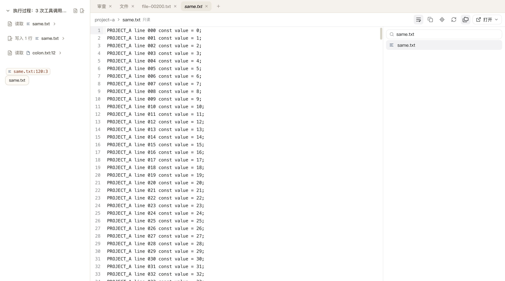
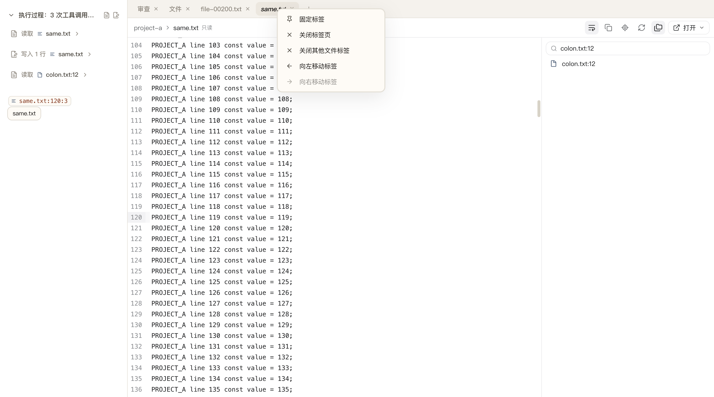
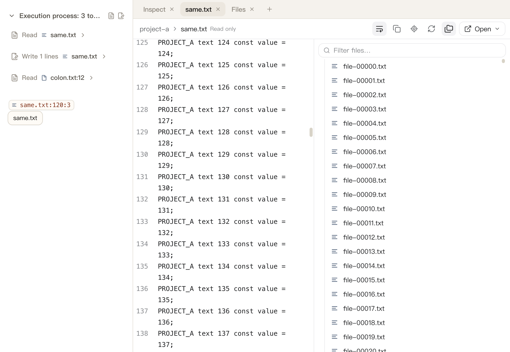

# FR-07：生产文件树与统一标签

本阶段在 `.worktrees/file-review-workbench` / `codex/file-review-workbench` 接入生产文件界面。原工作区由另一任务使用，未修改、切换或重置。

## 生产行为

- `ProjectFilePanel` 复用 `FileWorkbench`、CodeMirror 和生产文件 API。聊天 Markdown 路径、工具过程行、变更摘要、Git 审查和文件树均打开统一标签，同时展开外层工作台；App 不再挂载旧 `FileDrawer`。兼容导出和旧目录辅助函数保留，避免扩大本阶段迁移范围。
- 文档键为项目根目录和规范化相对路径，同项目不同会话共用磁盘正文、一次活动读取及路径订阅；视图键另包含会话，各自保存标签、宽度、目录展开、筛选、树滚动和编辑器滚动/选区。外来订阅、重复序号、旧读取和断开后迟到结果不会覆盖新文档；迟到订阅也会解除。没有视图的文档缓存有 24 项保留上限。
- 统一入口支持绝对/相对路径及 `path:line:column`，重复同位置点击会再次定位。文件树、Git 和工具变更使用 literal 路径，保留真实冒号文件名；Windows 分隔符和项目根大小写有独立处理，项目外路径给出中文/英文反馈，主进程继续复核真实路径边界。
- 每个项目/会话最多一个可替换预览标签；双击文件/标签或菜单可固定。支持原生指针拖动排序、键盘左右切换与排序、右键/键盘菜单、关闭其他文件标签；后者保留浏览器、终端、审查和子会话等工具标签。重载恢复文件顺序、预览标记和活动文件。
- 正常文件树与输入框 `@` 共用完整工作区索引，搜索不受显示行数限制；固定高度虚拟行保留第 201/8001 个文件。根目录和显式展开的隐藏/忽略目录通过生产目录 API 读取全部页面，可继续展开子目录；加载、失败和重试有独立状态，刷新保留已有可用列表。方向键、Home/End、Enter/Space、筛选和当前文件定位可用，IME 按键不会被导航截获。
- 文件正文按活动路径自动核对；空、缺失、二进制、非法 UTF-8、失败和截断提示独立于源码。隐藏标签停止自身读取/订阅并保留最后显示的正文，激活后应用共享文档变化；不把隐藏编辑器的零尺寸滚动值写回另一个会话的阅读位置。
- CodeMirror 在目标区域测量完成后通过公开 `scrollIntoView` / `scrollHandler` 恢复精确滚动值，保留仍有效的选区。新定位、用户操作、下一次更新和卸载可取消待执行恢复；不依赖私有编辑器字段，也不循环争抢滚动。

## 验证记录

- 最终 `pnpm test --reporter=dot --maxWorkers=1` 为 **137 文件 / 1157 用例通过**（94.89 秒）；`pnpm typecheck`、`pnpm build` 和 `git diff --check` 通过。全量测试与构建顺序运行，避免构建清理测试正在使用的 RPC 产物。
- 新增文档共享/订阅竞态、路径解析/存储和标签状态回归；连同既有 panel-state 为 **4 文件 / 41 用例通过**。
- `pnpm test:file-workbench` 使用生产 Electron/preload/文件与 Git IPC、真实临时 Git 仓库、两个同名路径项目及 Chromium 原生鼠标/键盘，**7 个阶段通过**。覆盖 8105 文件的后部检索、预览替换/双击固定、隐藏/忽略展开、冒号文件、所有文件入口、菜单/拖动/键盘排序、定位、正文追加与整段替换、不同会话更新同文件、项目切换及重载后的精确滚动/选区恢复、关闭其他文件、中英文/窄面板、隐藏暂停/再激活和窗口资源释放。
- 最终工作台外部更新 **43.0 ms**，网络请求与 renderer 错误为 0；关窗后文件 subscriptions/roots/reads 和 Git projects/subscriptions/reads 全部为 0。原始结果见 [fr-07-result.json](file-review-reference/fr-07-result.json)。这是临时 APFS 项目的一次验收，不是 FR-15 的固定设备性能基准。
- `TACODE_PREVIEW_SMOKE=1 node scripts/test-session-activity.mjs` 在真实 App 下通过整段替换后的滚动保持、无关文件不重读、隐藏暂停/激活核对、迟到读取、删除/空/失败重试/截断状态和复制路径，最终刷新 **175.6 ms**。App 夹具已注册生产文件/Git IPC，主动注入读取/列表失败用于验收错误恢复。
- 收尾发现并修复隐藏会话共享更新把阅读位置写成 0，以及测量后的滚动补偿造成偏移；验收保留精确像素断言。原生输入夹具先聚焦并确认页面可见，避免窗口遮挡暂停订阅造成假失败。
- 工具记录按实际路径打开，Markdown 引用单独解析行号；真实 Electron 覆盖工具/树共享 `colon.txt:12`，以及 macOS 的合法 `a:1` 文件名，避免误判成 Windows 驱动器路径。
- 原有 `session-index.test.ts` 在全量运行中未发现监听注册后立即创建的文件，连续单跑通过。夹具新增实际通知准备条件后再验证单次外部新增，原 3 秒超时及关闭回收断言保留；未修改会话索引生产实现。
- `TACODE_FILES_SMOKE=1 node scripts/test-session-activity.mjs` 在真实 App 下通过深层路径、第 201 个同目录文件、超过 8000 文件的 `@` 引用、共享索引更新、保留已有列表的失败提示和重试。主动注入的 `fixture file listing failed` 用于验收恢复行为。
- `TACODE_SMOKE_ONLY=workbench,message-list node scripts/test-browser.mjs` 通过完整工作台标签/浏览器迁移、顶部标题、原生面板宽度拖动与侧栏动画、报告排版、子会话入口及自动打开、输入框工具栏和 150 轮消息列表回归。浏览器导航、本地 BrowserPanel 预览/live reload、文件组件 5 阶段和生产 Git 23 阶段回归也已通过。
- 既有工作台烟测的进程内活动断言对齐 `c8f8023` 后的生产转录/报告契约；Composer 夹具按父组件递增 `fillToken` 的契约注入初始草稿。原生宽度拖动先聚焦并等待页面绘制，保持原有布局、草稿和事件断言。
- 工具栏回归发现输入框 `backdrop-filter` 导致菜单的固定定位使用父容器坐标，260px 窗口右侧溢出 17px。菜单改用实际 `offsetParent` 转换坐标；原生验收通过 full/icons/overflow、五项入口、嵌套弹层边界、草稿保留、发送/停止、Escape 和字体放大恢复。失败信息增加真实矩形，边界断言未放宽。

## 截图

已检查原生 Electron 截图：中文标签菜单与 1000px 窗口英文布局无工具栏溢出或文字重叠。

## 后续边界

- FR-07 的生产文档保持只读；直接编辑、保存、未保存内容及冲突处理属于 FR-08。文件管理与外部编辑器选择/行定位属于 FR-09；Markdown/HTML/图片等多格式视图及大文件分块界面属于 FR-10。旧 HTML 标签的渲染入口随统一迁移暂以源码视图替代，完整格式切换尚未交付。
- 默认完整搜索针对共享正常索引，隐藏/忽略子树按展开按需读取；不在打开项目时遍历全部生成目录。当前恢复上限为每个作用域 100 个文件标签，存储不可用时仍可使用内存视图。
- 最近一轮冻结审查、评论、AI 审查、最终视觉对照、Windows 实机和大规模性能仍待 FR-11～15；本阶段通过不代表完整复刻完成。
