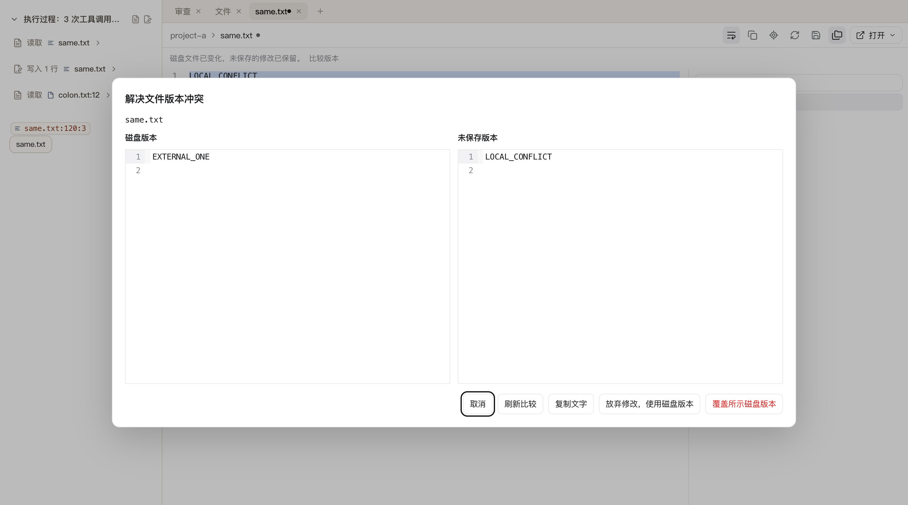
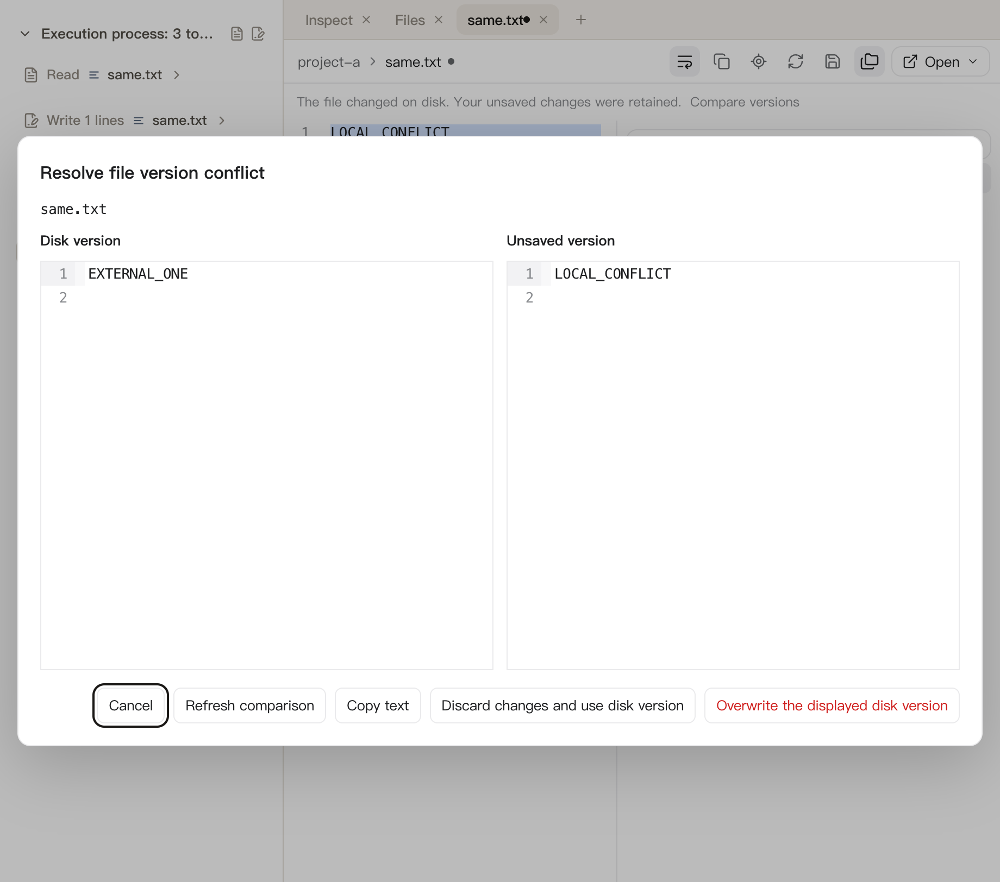
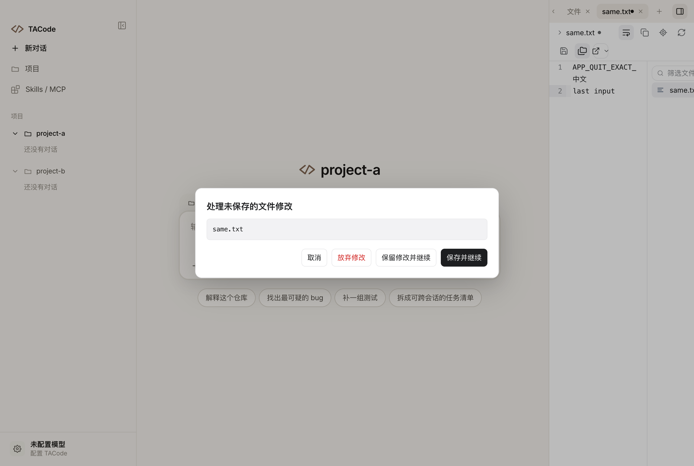
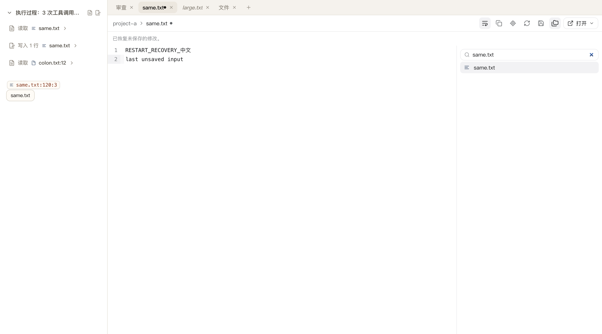

# FR-08：生产编辑、保存和未保存内容保护

本阶段仅在 `.worktrees/file-review-workbench` / `codex/file-review-workbench` 实施 FR-08。另一任务使用的原工作区未修改、切换或重置，专项整合仍待 FR-15。

## 交付行为

- 可写且完整读取的 UTF-8 文本和空文件接入生产 CodeMirror 编辑器：高亮、行号、查找替换、定位、撤销重做、换行、保存按钮及 Mod-S。截断、二进制、非法编码和不可写文件保持只读，不允许把截断正文写回磁盘。
- 项目根目录和相对路径共同标识文档；同项目不同会话共享磁盘版本和编辑草稿。未保存的预览标签自动固定，打开另一个文件不会替换它；标签和面包屑显示未保存标记。隐藏视图保留显示版本，激活后应用共享更新。
- 保存复用生产版本校验和原子发布，保留 BOM、CRLF 和文件权限。外部修改保留草稿及原始基线；冲突弹窗显示捕获的磁盘版本和当前未保存文字，支持取消、刷新比较、复制、放弃并使用磁盘版本、覆盖所示版本。磁盘再次变化会禁用旧覆盖按钮，主进程仍复核版本；文件被删除时保留本地文字，不能盲目重建或覆盖。
- 保存期间合并重复请求，阻止旧读取覆盖保存结果。新输入以及撤销回保存前基线均保留为基于新磁盘版本的未保存草稿；保存失败不清空草稿。成功发布后再次核对实际磁盘内容，发现立即被外部改写则报告冲突。
- 关闭单个或其他文件、切项目、打开其他项目的会话、移除项目、重载、原生关窗和退出均经过未保存保护。提供保存、放弃、取消；切项目、重载和退出还可保留并继续。正在保存时先等待结果；备份失败阻止离开，保存期间产生新修改也需要再次处理。取消退出发生在停止 Agent 和关闭服务之前。
- 恢复记录写在应用恢复目录，包含准确文字、原始基线、版本、换行、项目和路径。200 ms 合批写入，正常离开前等待原子备份完成；恢复后打开固定标签并标明未保存。序列化写入和删除、主 frame 所有权及项目授权复核，避免迟到写入重新创建已放弃记录。损坏记录保留并报告，不能读取恢复记录时暂停对应文件编辑。
- 恢复目录限制 100 条、总计 128 MiB、每段文本 16 MiB；达到限制明确失败并保留已有记录，不淘汰未保存文字。原生恢复文件权限为 0600，目录按应用原子写入约定创建。仓库文本保存上限仍为 4 MiB。

## 验证

- 最终全量 `pnpm test --reporter=dot --maxWorkers=1`：**139 文件 / 1170 用例通过**，95.93 秒；`pnpm typecheck`、`pnpm build`、最终 renderer 构建和 `git diff --check` 通过。全量测试与构建顺序运行，避免清理测试中的 RPC 产物。
- 新增/扩展恢复、关窗和共享文档回归，定向共 **18 用例**：新服务恢复准确正文/基线、写入与删除排序、拒绝越界、授权失效/原子失败、存储满不淘汰、损坏记录不删除、保存和旧响应竞态、保存期间新输入及撤销回旧基线、恢复失败与备份失败。
- `pnpm test:file-editing`：**两个独立 Electron 进程 / 12 阶段通过**。使用生产 preload、文件/Git IPC、Chromium 原生键鼠和真实 APFS 文件，验证真实编辑/保存、BOM/CRLF/mode、查找替换/定位、失败及延迟保存、外部写入/删除、捕获版本的比较及过期覆盖拒绝、单个/批量关闭、切项目取消/保留/备份失败、同名项目隔离、截断只读、取消重载后订阅与保护继续有效、重载恢复、退出前备份及完整进程重启恢复。
- 比较正文加载后校验两侧实际文字及只读状态、白色不透明背景；920px 英文窗口校验全部命令位于弹窗内且文字未溢出。中文、英文和恢复截图已检查。两次进程的网络请求、renderer 错误均为 0；关窗后文件 subscriptions/roots/reads 和 Git projects/subscriptions/reads 均为 0。原始记录：[fr-08-result.json](file-review-reference/fr-08-result.json)。
- `pnpm test:file-editing-app`：**完整生产 main/preload/App / 3 阶段通过**，未替换生产退出逻辑。临时 appData/TACODE_HOME 和两个真实项目，语义点击项目入口、原生编辑/弹窗输入；确认项目切换取消/保留、退出取消后服务继续可用、零 Agent 启动，最后批准退出。父进程独立确认自然退出码 0、准确恢复记录和磁盘未改写。原始记录：[fr-08-app-result.json](file-review-reference/fr-08-app-result.json)。
- `pnpm test:file-workbench`：7 阶段导航回归通过，外部刷新 **129.8 ms**，项目/会话、标签、精确位置恢复及资源释放保持正确。原始记录单独保存在 [fr-08-workbench-result.json](file-review-reference/fr-08-workbench-result.json)，既有 FR-07 证据保持原样。
- `pnpm test:file-review`：5 阶段组件回归通过。`pnpm test:git-review`：23 阶段生产 Git 读取、暂存、还原、提交、推送、取消和资源释放通过，刷新 **334/335 ms**，网络/renderer 错误为 0；推送只到临时本地裸仓库。记录：[fr-08-git-result.json](file-review-reference/fr-08-git-result.json)。
- `node scripts/test-browser.mjs`：BrowserPanel 本地预览及 live reload、原生拖动、统一标签、顶部标题、侧栏、报告、子会话、Composer 和 150 轮消息列表回归通过。Chromium 在 guest 切换期间仍打印既有 Widget mojo 日志，不是编辑专项的 renderer 异常。
- `TACODE_PREVIEW_SMOKE=1 node scripts/test-session-activity.mjs`：真实 App 文档刷新 **167.4 ms**，滚动、隐藏暂停/激活、迟到响应、删除/空/失败重试/截断及路径复制通过。
- `TACODE_FILES_SMOKE=1 node scripts/test-session-activity.mjs`：真实 App 深层路径搜索、同目录第 201 个文件、超过 8000 文件的 `@` 引用、文件面板与引用共享更新、加载失败和重试全部通过；输出中的 listing failed 为夹具主动注入。

## 修复记录

- 保存等待期间撤销到旧磁盘内容会暂时没有 draft；保存完成现在依据编辑修订号保留这次撤销，更新恢复基线。
- 外部版本由 CRLF 换成 LF 后，CodeMirror 同步切换输出换行配置并使用结构化 Text 接收正文，避免旧分隔符导致额外换行。
- Electron 销毁窗口后不再读取 BrowserWindow 的 `webContents` getter，关窗清理使用提前捕获的引用；单元回归和两个完整原生进程确认清理正常。
- 弹窗复用白色工作台 tokens，正文加载后再拍摄和核对；保存为墨色主操作，放弃/覆盖为危险操作。离开弹窗时恢复仍存在的先前焦点。

## 截图

## 边界和下一项

- 正常离开会等待备份；强制结束进程或断电仍可能丢失尚未进入 200 ms 合批备份的最后输入。恢复目录不可用时有明确提示，不能承诺机器被强制结束前一定写入。
- 本阶段支持显式覆盖捕获版本或使用磁盘内容，没有自动三方合并。磁盘文件已删除/变为二进制时，本地草稿可复制和保留，重建文件属于 FR-09。
- 多格式预览、文件管理与外部编辑器、冻结的最近一轮审查、评论、AI 审查、最终视觉、Windows 实机和性能验收仍按后续阶段交付；本阶段通过不代表完整复刻完成。
- 下一条仅为 **FR-09：文件管理与外部打开**。当前专项 **8/15**，本轮不开始 FR-09，完整目标保持 active。
