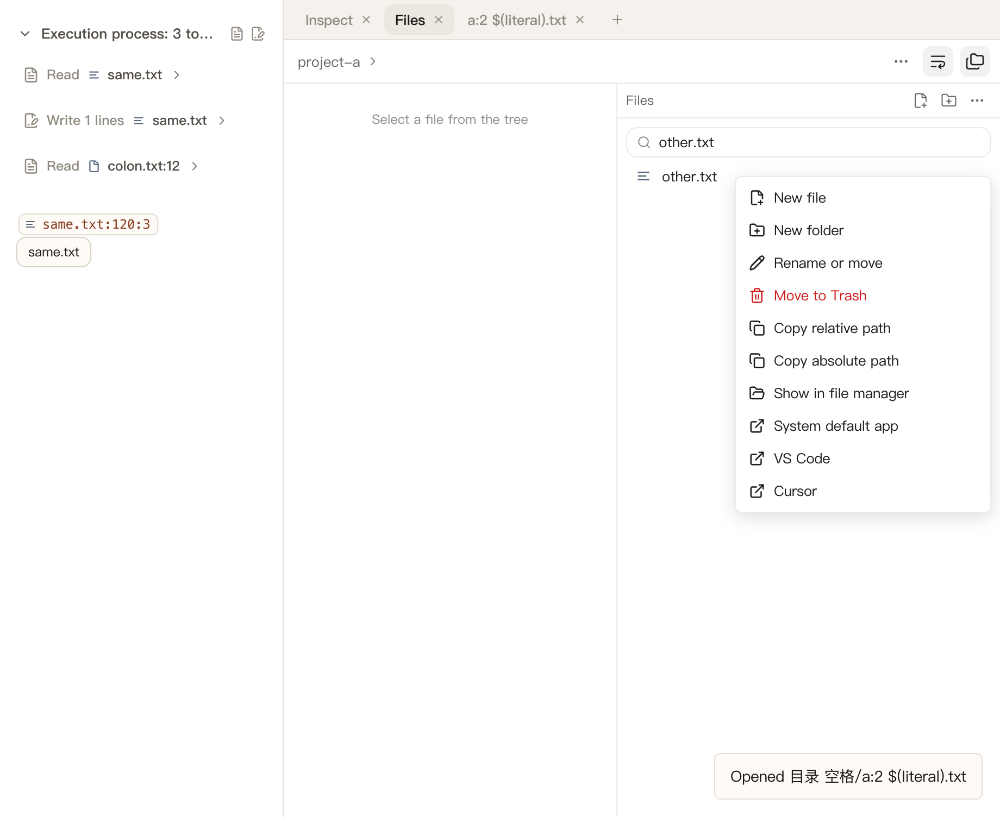
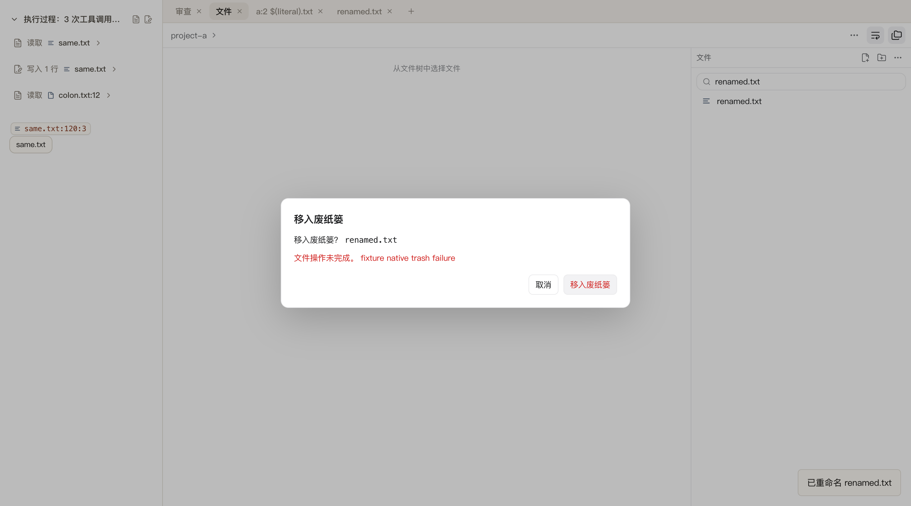

# FR-09：文件管理与外部打开

本阶段在 `.worktrees/file-review-workbench` / `codex/file-review-workbench` 完成 FR-09。另一任务使用的原工作区未修改、切换、重置或停止；分支整合仍待 FR-15。

## 交付行为

- 文件树、根目录和文档工具栏提供新建空文件、目录、重命名或移动、移入系统废纸篓、复制相对/绝对路径、文件管理器定位。新文件直接打开固定标签，可继续编辑保存；结构操作成功后更新共享索引、树和标签，并显示本地化结果。
- 重命名和废纸篓操作绑定确认时的文件版本。目录版本包含全部后代的文件身份、时间戳、大小、权限及链接目标；子文件发生变化也拒绝旧确认。已有目的地不会被覆盖，保留源文件及目标原有内容；取消或失败清理仍属于本操作的目的地占位。
- 路径必须显式绑定已打开项目。拒绝根目录结构操作、路径越界、Git 元数据及指向元数据的父目录别名、非法 Unicode 和平台非法名称；复核父目录权限及当前窗口所有权。管理符号链接本身，不跟随其项目外目标；不能通过项目外链接创建文件。实际 APFS 大小写重命名更新真实目录项。
- 结构操作和文档保存共用写队列。重命名、废纸篓和外部打开先处理涉及的未保存文档，提供保存、放弃、取消；保存改变捕获版本时要求再次确认。操作期间锁定子树，其他会话及新打开的相同文件不能产生新的编辑；关闭、重载和退出等待已开始的结构或外部操作。
- 成功重命名迁移所有会话的标签、活动文件和持久阅读/展开状态，保留准确滚动及选区。迟到的旧视图清理写入转向新路径，移入废纸篓后移除相应标签；其他项目不受影响。损坏的存储键不会中断后续正常会话的迁移。
- “打开”菜单列出系统默认应用、已检测到的 VS Code/Cursor 和文件管理器定位。VS Code/Cursor 接收绝对路径及当前行列，参数不经过 shell；目录直接打开。探测 macOS 系统/用户 Applications、Windows 安装目录和 Linux PATH，并兼容 Cursor 包内的 `cursor`/`code` CLI 名称。
- POSIX 编辑器 CLI 等待退出并报告失败，15 秒未完成有明确错误；Windows GUI 启动后确认接收。系统打开返回错误、编辑器未安装、路径不存在和文件操作失败均有反馈，失败不会关闭结构操作确认框，可重试。
- 菜单使用 Chromium 原生 popover，确认使用原生 dialog；支持方向键、Home/End、Escape、焦点恢复和 IME 检查。图标使用 lucide，中英文沿用工作台白底 tokens；窄窗菜单约束到视口内，成功提示只有一个且随当前语言呈现。

## 验证

- 最终 `pnpm test --reporter=dot --maxWorkers=1`：**141 文件 / 1190 用例通过**，96.61 秒；`pnpm typecheck`、`pnpm build` 和 `git diff --check` 通过。全量测试与构建顺序执行，避免清理正在使用的 RPC 产物。
- 新增/扩展真实文件管理、外部编辑器、IPC、共享文档、标签和持久状态回归：版本过期、后代变化、已有目的地、取消与并发写入、权限/边界/符号链接、大小写重命名、保存队列、关闭等待、项目隔离及损坏存储迁移。
- `pnpm test:file-management`：**10 阶段通过**，自然退出码 0。生产 preload、文件/Git IPC、WorkbenchPanels 和 Chromium 原生输入，真实 APFS 文件覆盖中文、空格、冒号、shell 字符、新建/保存、拒绝覆盖、两会话精确位置迁移、未保存取消/保存/再确认、过期废纸篓、失败/重试、剪贴板、外部参数及窄窗英文键盘/焦点/边界。网络、renderer 错误和关闭后文件/Git 资源均为 0。[原始记录](file-review-reference/fr-09-result.json)。
- 专项通过同一原生菜单、IPC 和生产 mutation service 将唯一临时文件移入真实 Electron 系统废纸篓，确认源文件消失；随后恢复并清理，`nativeTrashRestored: true`。失败测试使用可恢复的废纸篓适配器，系统打开/定位使用记录参数的适配器；VS Code/Cursor 使用真实可执行的测试 CLI 核对参数，不启动用户已安装的编辑器。
- `TACODE_FILE_EDIT_REPORT=docs/file-review-reference/fr-09-editing-result.json pnpm test:file-editing`：**两个独立 Electron 进程 / 12 阶段通过**，准确保存、外部冲突、保存中新输入、关闭/重载保护及重启恢复保持正确，均自然退出码 0；网络、renderer 错误和关闭后资源为 0。[记录](file-review-reference/fr-09-editing-result.json)。
- `TACODE_FILE_EDIT_APP_REPORT=docs/file-review-reference/fr-09-app-result.json pnpm test:file-editing-app`：**完整生产 main/preload/App / 3 阶段通过**。项目切换取消/保留、退出取消后的服务可用及最终恢复写入由父进程验证，自然退出码 0、准确恢复文字、磁盘未改写。[记录](file-review-reference/fr-09-app-result.json)。两个编辑运行器新增可选报告路径，既有 FR-08 证据保持原样。
- `TACODE_FILE_WORKBENCH_REPORT=docs/file-review-reference/fr-09-workbench-result.json pnpm test:file-workbench`：**7 阶段通过**，文件 201/8001、共享入口、标签/树导航、精确阅读位置、隐藏暂停和项目隔离保持正确；刷新 **170.5 ms**，网络/renderer 错误及关闭后资源为 0。[记录](file-review-reference/fr-09-workbench-result.json)。
- `pnpm test:file-review`：**5 阶段通过**。[记录](file-review-reference/fr-09-component-result.json)。`pnpm test:git-review`：**23 阶段通过**，覆盖真实读取、暂存、还原、提交/推送、取消和资源清理；刷新 **327/333 ms**，网络/renderer 错误和关闭后 Git 资源为 0，推送仅到临时本地裸仓库。[记录](file-review-reference/fr-09-git-result.json)。
- `node scripts/test-browser.mjs`：实际 BrowserPanel 本地预览/live reload、原生拖动、统一标签、顶部标题、侧栏、报告、子会话、Composer 和 150 轮消息列表回归通过。Chromium guest 切换仍有既有 Widget mojo/macOS task policy 日志，进程退出码 0。
- `TACODE_PREVIEW_SMOKE=1 node scripts/test-session-activity.mjs`：实际 App 文档刷新 **168.8 ms**，滚动、隐藏/激活、旧响应、删除/空/失败重试/截断和路径复制通过。`TACODE_FILES_SMOKE=1 node scripts/test-session-activity.mjs`：深层搜索、同目录第 201 项、8000+ 文件引用、共享更新及失败重试通过；输出中的 `fixture file listing failed` 为主动注入。

## 截图

最终中英文截图已检查；英文成功提示、菜单按钮文本及窄窗边界有实际断言。

## 边界和下一项

- 废纸篓使用系统能力，不执行永久删除；系统不支持或操作失败时明确报告。测试不代表已验证真实 Finder/Explorer 或用户编辑器界面的行为。
- 本阶段移动使用文件系统 rename，不实现跨卷复制后删除；不支持覆盖已有目标。Windows 实际执行、系统废纸篓和编辑器集成仍待 FR-15 实机验收，安装路径已覆盖单元回归。
- 多格式预览、冻结的最近一轮审查、行级反馈、AI 审查、最终视觉及性能仍待后续阶段。本阶段通过不代表全部复刻完成。
- 专项 **9/15**；下一条仅 **FR-10：多格式预览与大文件**，本轮未开始。完整目标保持 active，分支仍隔离且未合并。
