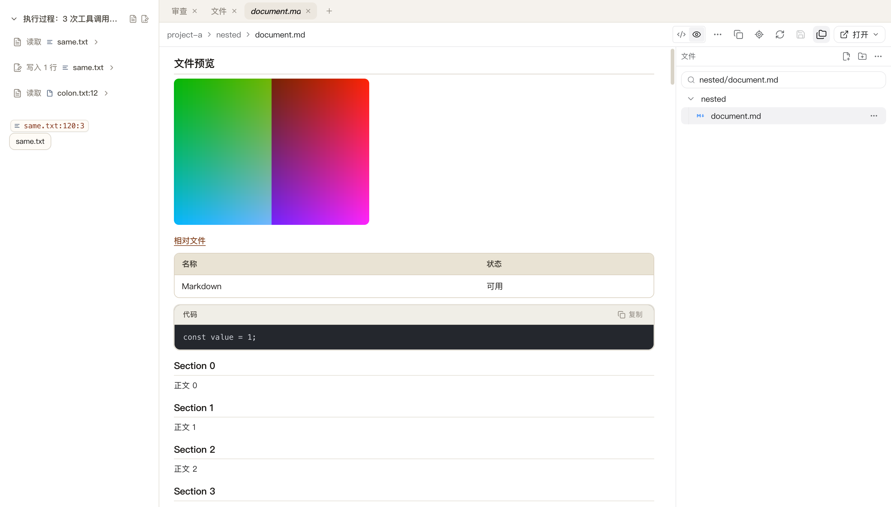
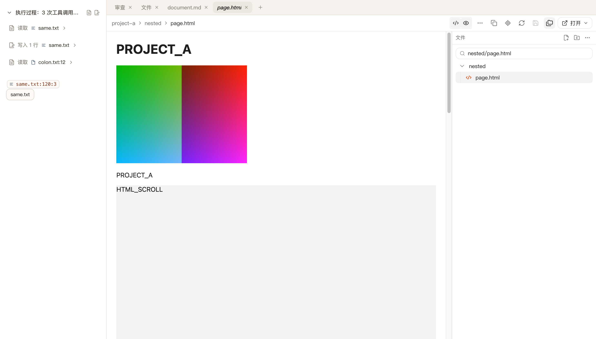
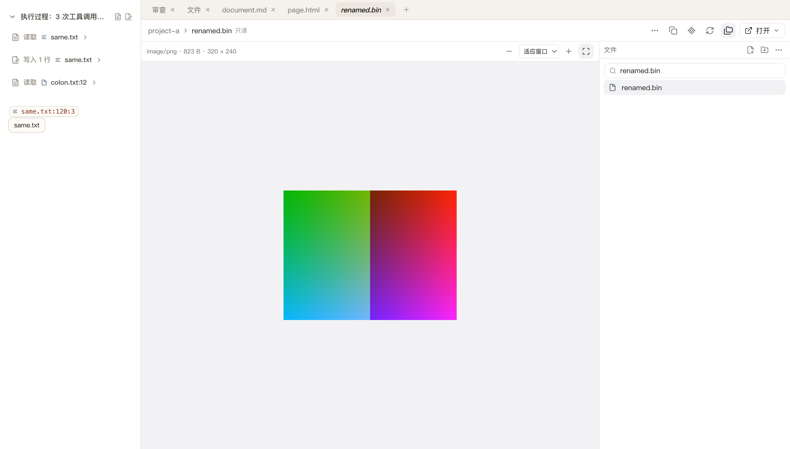
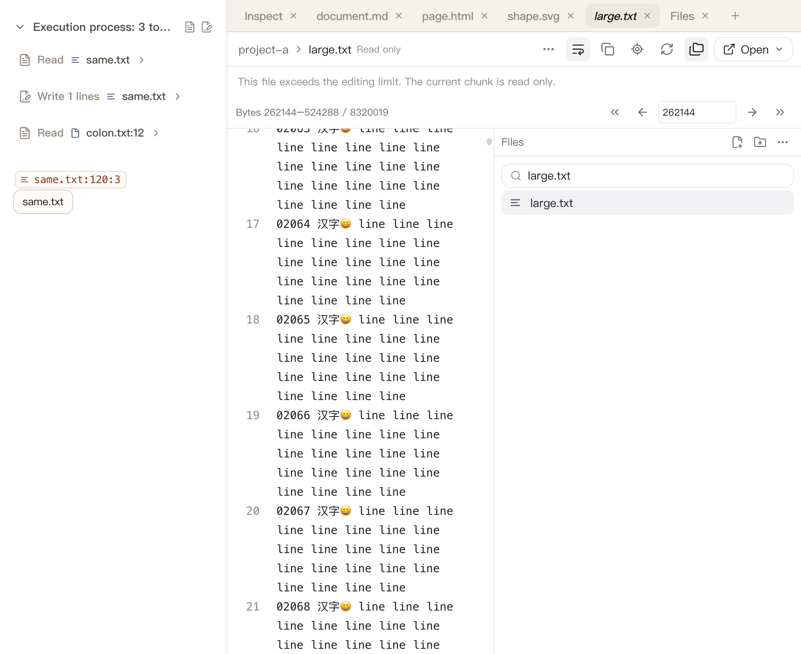

# FR-10：多格式预览与大文件

本阶段在 `.worktrees/file-review-workbench` / `codex/file-review-workbench` 完成 FR-10。另一任务使用的原工作区未修改、切换、重置或停止；分支整合仍待 FR-15。

## 交付行为

- Markdown 与 HTML 在源码/预览之间切换。Markdown 复用工作台 GFM、代码块和 KaTeX 渲染，相对图片按项目预览域解析，相对链接打开当前项目内的目标文件；修改未保存时预览显示当前文字，不写磁盘，`Mod-S` 才实际保存。
- HTML 预览在内存快照中追加读取位置脚本，通过显式项目预览域提供服务：脚本、相对图片、`fetch` 和 `localStorage` 均按项目隔离，同名文件在两个项目互不影响；快照内没有 Node、`require` 或工作台桥，`parent` 访问被拒。磁盘更新、源码/预览切换和隐藏后重新激活都恢复精确滚动位置，隐藏面板释放快照、订阅和在途读取，重新激活后再按新内容重建。
- 图片按扩展名和文件头签名识别 PNG/JPEG/GIF/WEBP/SVG/PDF 等类型；数值型图片只读且不拼进编辑器文字，SVG 作为图片渲染且不执行其中脚本。工具栏支持放大/缩小/适应窗口和缩放比例，缩放值随视图保存；脏 SVG 预览同样不落盘。
- 二进制和非法编码显示实际类型与精确大小（KiB/B 双单位），并提供显式绑定当前项目的“打开”入口，复用 FR-09 的系统/编辑器菜单。
- 空文件、只读、缺失、读取失败/重试、加载中和超限截断分别呈现，互不混淆；空文件是可编辑的 `empty` 状态，缺失文件在删除后立即切换。
- 文本上限仍为 4 MiB，边界值（恰好 4 MiB）完整可编辑并真实保存。超过上限的文件按 256 KiB 分块只读读取：前端可遍历全部 32 个分块直到尾部，无缝隙、无替换字符，生产服务的部分写回被拒绝且磁盘原文不变。只读态由生产 CodeMirror 的 `contenteditable=false` 断言。
- 大文件工具栏显示实际字节区间（`字节 from–to / size`），支持开头/上一段/下一段/末尾和字节位置直达；每个分块独立保存精确的滚动与选区，外部版本变化、renderer reload 和窄窗英文布局都保持当前页与位置，过期页读取按版本拒绝。
- 阅读位置与视图状态按项目+会话+路径持久化：源码位置、预览滚动、图片缩放、当前分块和各分块位置相互独立，损坏或越界数据被丢弃而不影响后续恢复。

## 本轮修复：HTML 预览重新激活时的导航停滞

- 现象：原生烟测偶发在第 5 阶段失败（iframe 拿不到新快照）。修复前 4 次失败出现在 22 次运行中（约 18%），每次都是 15 秒超时。
- 证据：快照时间线显示新快照已创建（`render id=c383c382 body=REACTIVATED_HTML`），但 15 秒内没有任何对应的协议请求；iframe 的 `src` 已指向新快照，而唯一的活动子 frame 仍停在上一份快照上，面板可见、无错误提示。
- 原因：预览 effect 依赖整个 document 对象（`revision`），磁盘读取、加载标志或草稿状态每次变化都会重建快照并改写活动 iframe 的 `src`；当上一份文档仍在加载相对资源时，Chromium 会丢掉这次导航，新内容长时间不出现。
- 修复（`src/renderer/workbench/file-preview-content.tsx`）：effect 只依赖稳定的文档版本；每个快照使用独立 iframe 元素（`key={preview.id}`），不再改写活动 frame 的 `src`；被替换的快照在新快照就位后才释放，组件卸载时释放仍在显示的快照，活动 frame 不再指向已删除快照。
- 结果：修复后同一烟测连续 **12 次全部通过**，快照churn 同步下降（同一份磁盘内容不再重复建快照）。

## 验证

- 最终 `pnpm test --reporter=dot --maxWorkers=1`：**142 文件 / 1197 用例通过**，110.32 秒；`pnpm typecheck`、`pnpm build` 和 `git diff --check` 通过。构建与全量测试顺序执行，避免清理正在使用的 RPC 产物。
- 新增/扩展回归：HTML 快照的项目/路径/owner 绑定、内存上限、导航/崩溃/销毁释放和迟到准备取消（`preview-registry.test.ts`、`file-ipc.test.ts`）；精确 4 MiB 边界可编辑、超限分块无缝隙与部分写回拒绝、过期页版本冲突、图片签名识别与只读（`file-service.test.ts`）；预览/源码/分块位置持久化与非法状态丢弃（`file-view-state.test.ts`）。
- `pnpm test:file-formats`：**10 阶段通过**，完整遍历 **32 个分块**、准确保存 4 MiB 文本，结束后文件/Git 订阅、根 watcher、在途读取和 HTML 快照计数均为 0，网络请求与 renderer 错误为空。[原始记录](file-review-reference/fr-10-result.json)。该烟测在当前修复后连续 12 次重复运行全部通过。
- `TACODE_FILE_EDIT_REPORT=docs/file-review-reference/fr-10-editing-result.json pnpm test:file-editing`：**两个独立 Electron 进程 / 12 阶段**（初始 10 + 重启 2）通过，准确保存、外部冲突、保存中新输入、关闭/重载保护及重启恢复保持正确，网络、renderer 错误和关闭后资源为 0。[记录](file-review-reference/fr-10-editing-result.json)。
- `TACODE_FILE_EDIT_APP_REPORT=docs/file-review-reference/fr-10-app-result.json pnpm test:file-editing-app`：**完整生产 main/preload/App / 3 阶段通过**，自然退出码 0，恢复文字精确且磁盘未改写。[记录](file-review-reference/fr-10-app-result.json)。
- `TACODE_FILE_WORKBENCH_REPORT=docs/file-review-reference/fr-10-workbench-result.json pnpm test:file-workbench`：**7 阶段通过**，文件 201/8001、共享入口、标签/树导航、精确阅读位置、隐藏暂停和项目隔离保持正确；刷新 **162.8 ms**，网络/renderer 错误及关闭后资源为 0。[记录](file-review-reference/fr-10-workbench-result.json)。
- `pnpm test:file-review`：**5 阶段通过**；`pnpm test:git-review`：**23 阶段通过**，覆盖真实读取/暂存/还原/提交推送、取消与资源清理，刷新 **324/340 ms**，网络、renderer 错误和关闭后 Git 资源为 0，推送仅到临时本地裸仓库。
- `node scripts/test-browser.mjs`：实际 BrowserPanel 本地预览/live reload、原生拖动、标签、顶部标题、自适应分栏、侧栏、报告、子会话、Composer 工具栏和 150 轮消息列表回归通过。
- `TACODE_PREVIEW_SMOKE=1 node scripts/test-session-activity.mjs`：真实 App 文档刷新 **127.2 ms**，滚动、隐藏/激活、过期响应、删除/空/失败重试/截断和路径复制通过。该夹具原先断言旧截断文案，本阶段按新文案（分块只读）更新了期望字符串，仍断言截断状态出现；输出中的 fixture read failure 为主动注入。
- `TACODE_FILES_SMOKE=1 node scripts/test-session-activity.mjs`：深层搜索、同目录第 201 项、8000+ 文件引用、共享更新及失败重试通过。

## 截图

## 边界和下一项

- 无平台证据的 Windows 分块读取、图片解码和系统打开仍待 FR-15；本阶段仅在 macOS 上实测。
- HTML 快照有明确上限（单份 4 MiB + 8 KiB、最多 16 份、合计 64 MiB）、按 owner 释放，并在主 frame 导航、renderer 崩溃和销毁时整体清理；超限或非法 UTF-8 预览明确报错而不是静默截断。
- 分块只读是设计约束：超限文件不允许任何写回，服务端对部分内容写入返回 `tooLarge`；本阶段不实现大文件流式编辑或三方合并。
- 渲染层的快照生命周期（每份快照独立 frame、替换后才释放）由原生 Electron 烟测覆盖；仓库当前没有 DOM 单元测试环境，未新增组件级单测。
- 测试夹具 `scripts/fixtures/file-workbench.html` 的 CSP 已与生产 `index.html` 对齐（`frame-src harness-preview:`、blob 图片、`wasm-unsafe-eval`），不是为通过测试而放宽到生产之外。
- 冻结的最近一轮审查、行级意见、AI 审查、最终视觉/交互核对及性能与发布验收仍待 FR-11～15。本阶段通过不代表全部复刻完成。
- 专项 **10/15**；下一条 **FR-11：最近一轮审查**。完整目标保持 active，分支仍隔离且未合并。
