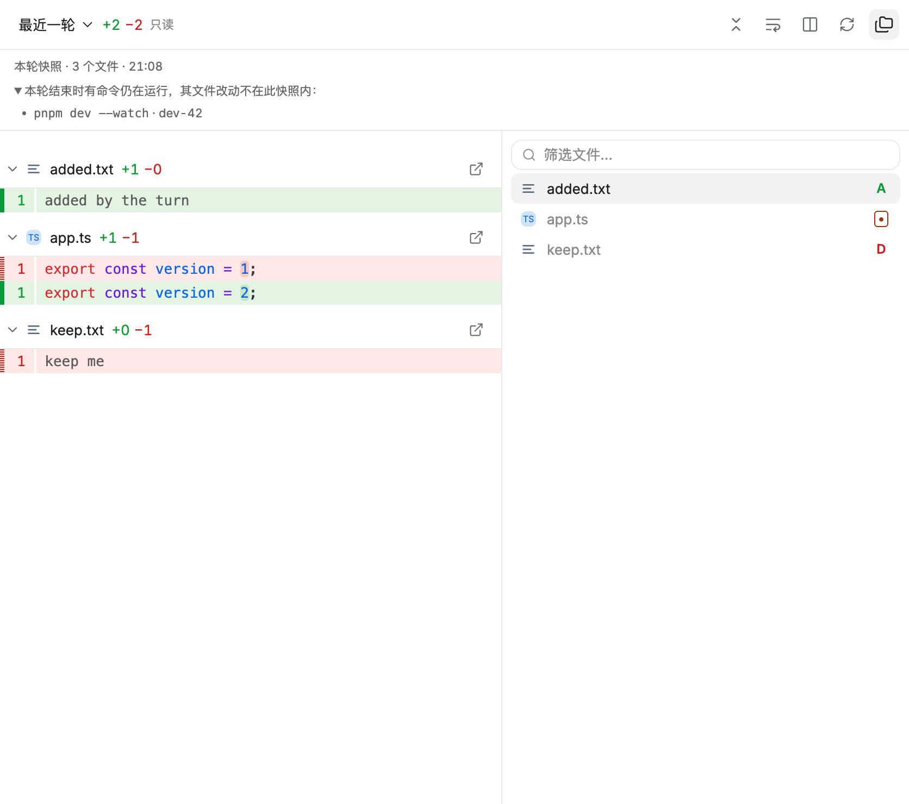
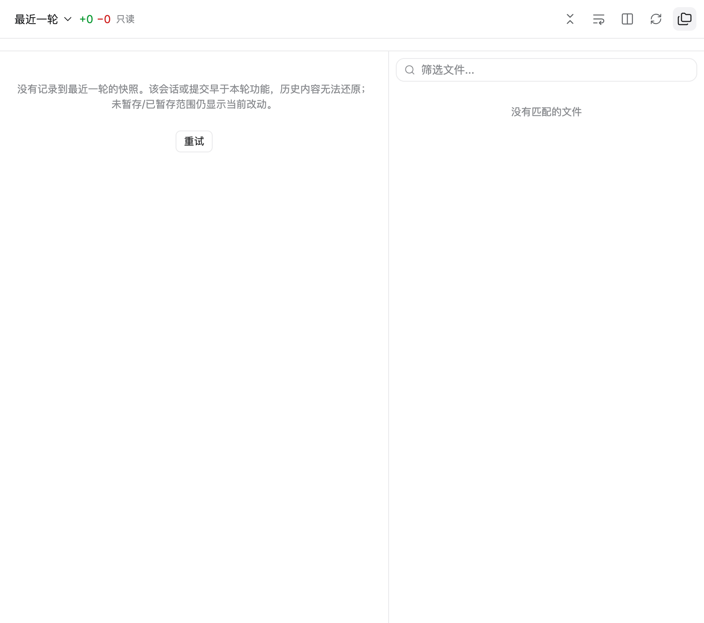

# FR-11：最近一轮审查

本阶段在 `.worktrees/file-review-workbench` / `codex/file-review-workbench` 完成 FR-11。另一任务使用的原工作区未修改、切换、重置或停止；分支整合仍待 FR-15。

## 交付行为

- 一轮对话的边界取 `agent_start`（用户请求开始）到 `agent_settled`（正常结束）或 `desktop_runtime_stopped`（停止）。主进程从真实运行时事件流里驱动，不根据工具计数或消息文本推测；事件带 `runtimeId`、会话文件和该会话的 cwd，委派子会话与侧聊不参与。
- 开始和结束各抓一份工作区快照：用项目私有的 `GIT_INDEX_FILE` 执行 `git add -A`（`--ignore-errors`）后 `write-tree`，两棵树都写进仓库对象库。快照因此由 Git 自身寻址、内容不可变，也不触碰用户的 index、HEAD 或 refs。
- 审查范围通过既有 Git 管线读取 `baseTree..targetTree`：统一/左右布局、折叠、上下文展开、语法高亮、二进制/超限/空文件元数据和文件树导航全部复用，范围标记为只读，不提供暂存/还原/提交入口。
- 覆盖范围是本轮工作区的真实差异，包含 `apply_patch`、同步命令和已完成异步命令的落盘结果，也包含新建/删除和未跟踪文件；按 Git 语义遵循 `.gitignore`。
- 结束时有命令仍在运行时（工具结果 `details.running === true`，即后台进程）在快照上标记命令文本、`processId` 和开始时间，明确说明其后续文件改动不在快照内。停止按钮收尾的快照标记为「本轮由用户停止」。
- 快照生成后不再随工作树或 index 变化而更新：其后变化只出现在未暂存/已暂存等实时范围，切回最近一轮仍是当轮内容。反之，记录中的范围不会把当前内容当成历史。
- 没有记录到快照（旧会话、早于本功能的提交或在非 Git 项目里运行）时明确提示并说明历史无法还原，同时提示未暂存/已暂存仍显示当前改动；快照对象被 Git 回收时提示已失效；抓取失败时给出具体原因；正在抓取时显示记录中。四种状态都不显示任何 diff，不用当前内容冒充历史。
- 新增独立服务 `TurnSnapshotService`：按项目隔离、抓取串行（同一项目不会有两个抓取共用私有 index）、在途抓取可等待（`idle()`）、失败原因持久化、每项目保留最近 8 份快照清单并原子写入私有目录，清单里包含文件数、增删行、基线/目标耗时、未结束命令和覆盖告警。
- 渲染层沿用原图的审查工作区：范围下拉里的「最近一轮」现在可选；范围栏显示快照摘要（文件数、时间）、未结束命令和覆盖限制，中英文与窄窗布局可用。

## 验证

- `TACODE_GIT_REVIEW_REPORT=docs/file-review-reference/fr-11-git-result.json pnpm test:git-review`：**27 阶段通过**（原 23 阶段 + 本轮 4 个新阶段），真实仓库、生产 preload/Git IPC/WorkbenchPanels 与原生输入，自然退出码 0。新阶段覆盖：一轮结束只显示自己的不可变改动并标记未结束命令；其后磁盘变化进入实时 Git 且不重写已记录的一轮；没有记录的轮次明确提示且不显示当前内容；对象被回收后提示失效且不显示当前内容。外部刷新 **325 / 335 ms**，本轮抓取在样例仓库上基线 **16 ms**、目标 **10 ms**，网络请求与 renderer 错误为 0，关窗后项目/订阅/读取为 0。[原始记录](file-review-reference/fr-11-git-result.json)。
- 新增 `src/main/git/turn-snapshot.test.ts`：**8 用例**覆盖一轮内新增/修改/删除与提交并发、后续变化不污染已记录范围、第二轮基线取当时工作区而非上一轮基线、未结束命令与停止收尾、嵌套项目只审查自身子树、非 Git 项目记录失败、跨项目拒绝、对象回收后拒绝读取、进程重启后复用清单、保留上限与发布回调。
- `pnpm test --reporter=dot --maxWorkers=1`：**143 文件 / 1206 用例通过**，99.73 秒；`pnpm typecheck`、`pnpm build`、`git diff --check` 通过。Git 定向套件 **6 文件 / 94 用例**通过。
- 回归：原生格式烟测 **10 阶段**、文件工作台 **7 阶段**（刷新 129.7 ms）、文件组件 **5 阶段**、编辑与重启恢复 **12 阶段**、完整生产 App 退出 **3 阶段**（恢复文字精确、磁盘未改写）、BrowserPanel/live reload/resize、真实 App 文档（185.1 ms）与深层/201/8000+ 文件检索全部通过；专项网络、renderer 错误和关闭后资源为 0。

## 截图

## 边界和下一项

- 快照对象是不带 ref 的悬空 Git 对象：`git gc --prune=now` 之类的主动回收会让快照失效，界面此时报「已回收」而不是回退到当前内容。清单按项目保留最近 8 份；对象本身由 Git 在正常 gc 周期后清理。
- 基线在模型流式生成期间抓取，通常早于本轮首个写入；若首个工具调用早于基线抓取完成，快照会带上「可能与基线并发写入」的覆盖告警，不静默假装完整。
- 差异是「一轮开始 vs 一轮结束」的工作区状态差：同一项目里两个会话同时运行时，各自的快照区间会包含对方在该窗口内的写入；区间不覆盖 `.gitignore` 忽略的文件，也不表示提交历史。
- 抓取只在项目是 Git 仓库且已授权时进行；非仓库项目记录失败原因。首次抓取需要按文件内容计算对象，超大仓库的耗时由 FR-15 在 2 万文件基准下测量，本阶段只记录样例仓库的实际数字。
- 行级意见、AI 审查、最终视觉核对和性能/发布验收仍待 FR-12～15；本阶段通过不代表全部复刻完成。
- 专项 **11/15**；下一条 **FR-12：行级意见与持久化**。完整目标保持 active，分支仍隔离且未合并。
