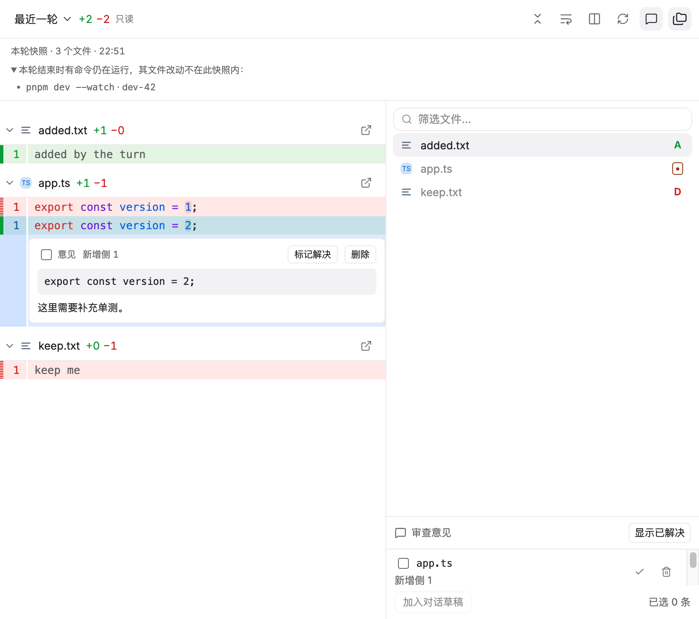
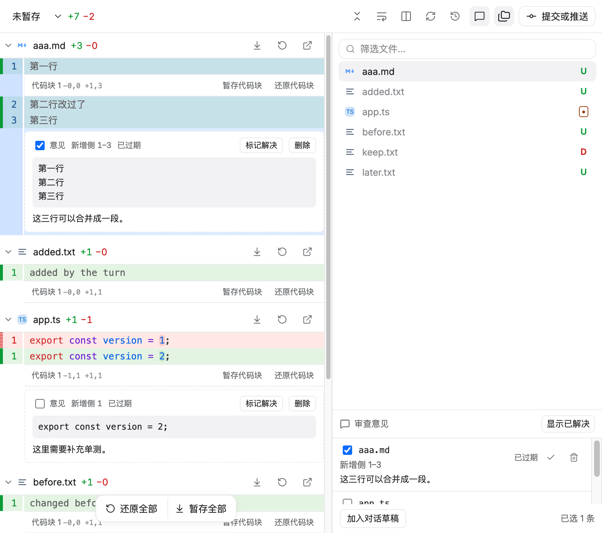

# FR-12：行级意见与持久化

本阶段在 `.worktrees/file-review-workbench` / `codex/file-review-workbench` 完成 FR-12。另一任务使用的原工作区未修改、切换、重置或停止；分支整合仍待 FR-15。

## 交付行为

- 在 diff 的行号列上按下并拖动（或按下后再 shift 点击）即可选中单行或多行，选中处直接展开意见输入框；输入内容后按 `Mod-Enter` 或点「添加意见」写入。选中和提交都走真实指针/键盘事件，输入框带 IME 保护。
- 每条意见绑定当时的比较范围、快照、文件版本、相对路径、所在侧（新增/删除）和精确行区间，并保存创建时的原始代码片段。切换布局、折叠文件、切换范围都不会移动这条绑定。
- 代码变化后意见被标为「已过期」，界面在行内卡片和列表两处都明确标注，不把旧意见悄悄画在新代码上；仍然可以定位、查看片段并删除。定位会跳到该文件、该侧的那一行。
- 右侧栏新增「审查意见」列表：显示路径、侧与行区间、意见正文、过期/已解决状态，支持勾选、定位、标记解决/重新打开、删除，以及显示/隐藏已解决（已解决默认不占列表，数量仍保留）。
- 勾选的若干条意见可通过「加入对话草稿」一次性写入当前对话输入框：包含序号、路径、侧、行区间、快照短标识、创建时的代码片段和意见正文。用户发送后即进入既有的对话修复流程；本阶段不自动发送、不自动改仓库。
- 意见按「项目 + 会话」隔离：同一项目换会话看不到，换项目也看不到，切回原项目/会话后恢复；渲染层重载后仍在。存储里损坏、越界、超长或重复的条目被丢弃而不影响其余意见，单次上限 200 条、正文与片段各 4 KiB。
- 无行级意见或未选中任何意见时，按钮和列表状态明确；只读范围（历史提交、分支、最近一轮）同样可以评论与收集，但不会提供任何写仓库入口。

## 验证

- `TACODE_GIT_REVIEW_REPORT=docs/file-review-reference/fr-12-git-result.json pnpm test:git-review`：**32 阶段通过**（原 27 阶段 + 本轮 5 个新阶段），真实仓库、生产 preload/Git IPC/WorkbenchPanels 与原生指针/键盘，自然退出码 0。新阶段覆盖：行选择创建绑定快照/侧/行/片段的意见；多行选择连同准确位置与片段进入对话草稿；解决/重新打开且已解决默认不占列表；文件版本变化把该意见标为过期；意见按项目与会话隔离并跨重载保留。外部刷新 **328 / 333 ms**，本轮快照抓取基线 **15 ms** / 目标 **10 ms**，网络请求与 renderer 错误为 0，关窗后项目/订阅/读取为 0。[原始记录](file-review-reference/fr-12-git-result.json)。
- 新增 `src/renderer/workbench/review-comments.test.ts`：**6 用例**覆盖项目/会话隔离与重载、损坏与越界数据丢弃、数量与长度上限、范围/快照/文件版本三种过期判定、四种比较范围的稳定键与快照标识、按路径分组与草稿文本的精确格式。
- `pnpm test --reporter=dot --maxWorkers=1`：**144 文件 / 1212 用例通过**，99.04 秒；`pnpm typecheck`、`pnpm build`、`git diff --check` 通过。
- 回归：文件工作台 **7 阶段**（刷新 164.7 ms）、文件组件 **5 阶段**、原生格式烟测 **10 阶段**、BrowserPanel/live reload/resize 与真实 App 文档（183.6 ms）全部通过；专项网络、renderer 错误和关闭后资源为 0。

## 截图

## 边界和下一项

- 意见保存在本机工作台存储（按项目 + 会话分键），不进入仓库、不进会话文件，也不随分支或提交移动；跨机器同步和团队共享不在本轮范围。
- 过期判定基于比较范围、快照标识和文件版本，不尝试把旧意见自动挪到新行号；这正是「不猜测历史」的要求，用户需要重新定位时按新版本重新提意见。
- 「加入对话草稿」只写入输入框，是否发送、如何修改由用户决定；不自动启动 Agent，也不在展示历史时启动主 Agent。
- 行内意见卡片位于 diff 内容流中，底部动作条（暂存/还原全部）会覆盖最后一条意见的按钮，需要滚动一下才能点到——因此同时提供 `Mod-Enter` 提交。窄窗与既有底栏的像素级核对留待 FR-14。
- AI 审查、最终视觉核对和性能/发布验收仍待 FR-13～15；本阶段通过不代表全部复刻完成。
- 专项 **12/15**；下一条 **FR-13：AI 审查**。完整目标保持 active，分支仍隔离且未合并。
