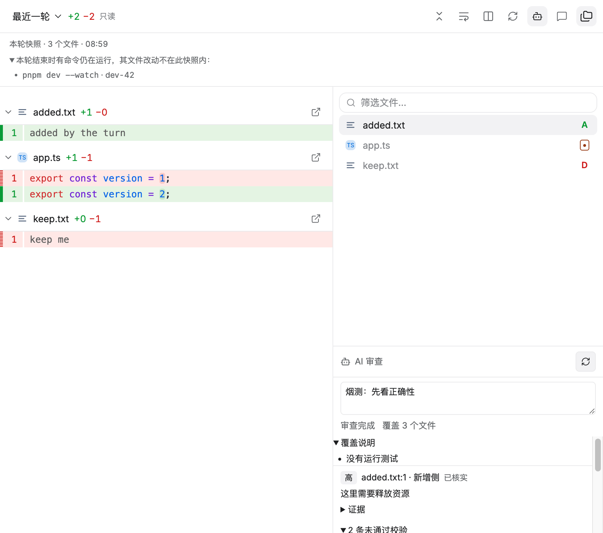

# FR-13：AI 审查

本阶段在 `.worktrees/file-review-workbench` / `codex/file-review-workbench` 完成 FR-13。另一任务使用的原工作区未修改、切换、重置或停止；分支整合仍待 FR-15。

## 交付行为

- 新增独立 `ReviewCoordinator`（主进程）：一次审查绑定一个冻结范围（未暂存/已暂存/指定提交/相对分支/最近一轮）+ 可选附加要求，只读运行一个独立 worker，产出结构化问题；不写仓库、不改用户文件，也不启动主会话的 Agent。
- worker 复用既有 `AgentHost` 与当前会话的供应商/模型配置，但**硬性只读**：`activeTools` 固定为 `read_file`/`list_files`/`search_files`/`exec_command`，命令策略 `readonly`（只跑白名单只读命令），权限 `plan`、沙箱 `read-only`、轮数上限 24。审查 worker 的事件不进主会话视图、不进活动存储，也不进「最近一轮」快照记录。
- 范围内容来自只读 Git 快照（与 diff 同源）：每个文件都带两侧真实行数，补丁按 1 MiB 预算裁剪；被裁剪的文件和二进制/超限文件在覆盖说明里明确标出。
- 结构化结果校验后才进入界面：路径必须在范围内，`side` 只能是 old/new，行号必须落在该侧真实行数内（没有行数据的二进制文件只接受 line 0 的文件级问题）。校验不通过的问题不会被丢掉，而是连同原因和原始 JSON 一起列在「未通过校验」里。
- 界面（审查范围栏右侧的「AI 审查」面板）显示：运行/完成/失败/已取消状态、覆盖文件数、截断与覆盖说明、每条问题的严重程度（高/中/低）、已核实/推断、路径:行号与侧，以及证据全文；点问题即跳到该文件该行。范围或快照变化的旧审查明确标为「与当前范围不一致」。
- 支持取消运行中的审查、失败后重试（同一范围与要求重跑）、历史记录（每项目保留最近 20 次），并随渲染层重载从磁盘读回；窗口重载/销毁会取消该窗口启动的审查，不留孤立 worker。

## 验证

- `TACODE_GIT_REVIEW_REPORT=docs/file-review-reference/fr-13-git-result.json pnpm test:git-review`：**37 阶段通过**（原 32 阶段 + 本轮 5 个新阶段），真实仓库、生产 preload/Git IPC/WorkbenchPanels 与原生指针/键盘，自然退出码 0。新阶段覆盖：只读审查按冻结范围校验问题并列出未通过条目（同一条报告里 1 条有效 + 2 条被拒）；失败时显示原因并用同一范围重试；运行中的审查可取消且历史保留；点问题定位到对应行、换范围后旧审查标为过期；重载后历史仍在（主进程持有运行）。外部刷新 **339 / 302 ms**，网络请求与 renderer 错误为 0，关窗后项目/订阅/读取为 0。[原始记录](file-review-reference/fr-13-git-result.json)。
- 离线烟测用**可注入 runner** 固定模型输出（真实模型调用需要联网与用户凭据，不在自动化验收内）；范围读取、提示词构造、结果校验、状态机、持久化、IPC 与界面渲染全部走生产代码。
- 新增单测：`src/main/review/review-findings.test.ts` **5 用例**（提示词含两侧行数与 schema、有效/被拒混合报告、行号越界与二进制行规则、不可解析报告、问题数量上限）；`src/main/review/review-coordinator.test.ts` **6 用例**（完成记录与发布序列、被拒条目与解析失败、取消与 worker 失败、重试沿用范围与要求、重载后历史、每项目 20 条上限）；`src/main/review/review-range.test.ts` **4 用例**（两侧行数计数、范围标签、快照映射与覆盖说明、超预算裁剪）。
- `pnpm test --reporter=dot --maxWorkers=1`：**145 文件 / 1227 用例通过**；`pnpm typecheck`、`pnpm build`、`git diff --check` 通过。回归：文件组件、文件工作台、原生格式烟测、真实 App 文档与 BrowserPanel 全部通过（见 `docs/file-review-reference/fr-13-*.json`）。

## 截图

## 边界和下一项

- 真实模型输出质量不属自动化验收范围：本阶段验证的是「范围正确、只读受限、结果被机械校验、状态与历史可靠」。模型不可用/凭据缺失时审查记为失败并显示原因。
- 审查不修改仓库、不写文件、不推送；发现的修复仍由用户在主会话里发起。
- 上下文栏（右侧）目前是「文件树 + 一个面板」：AI 审查面板展开时，重试按钮落在列底部，文件树占满列高会把面板下半部分挤出可视区，鼠标点不到（本轮烟测改为驱动与按钮相同的调用来验证状态机，界面上的可达性由 FR-14 统一修）。
- 性能（2 万文件范围、超大补丁裁剪代价）与 Windows 适配仍待 FR-15；本阶段不改变主线整合状态。
- 专项 **13/15**；下一条 **FR-14：视觉与交互完整性**。完整目标保持 active，分支仍隔离且未合并。
