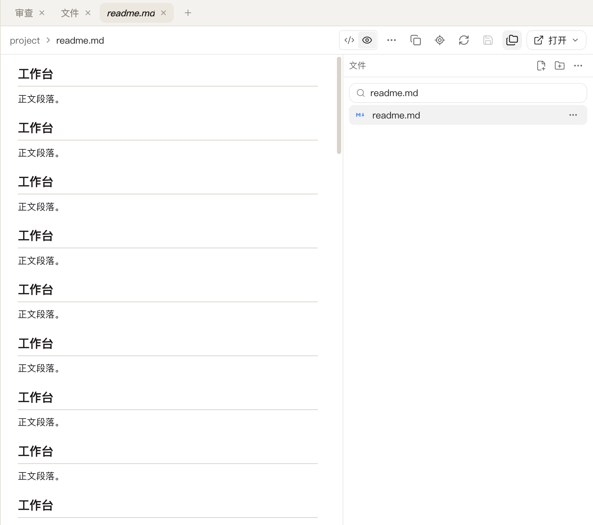
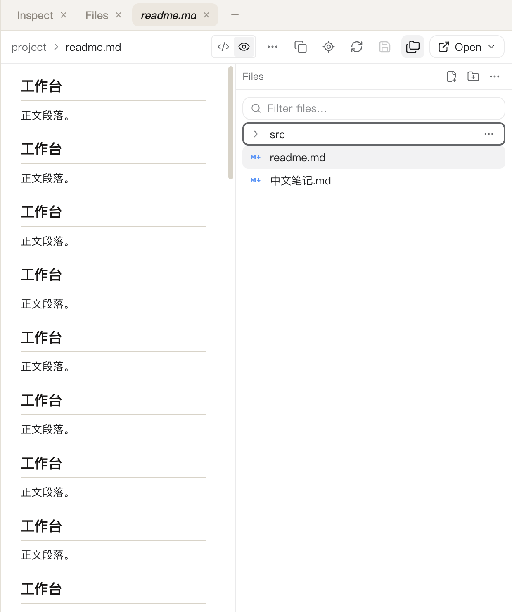
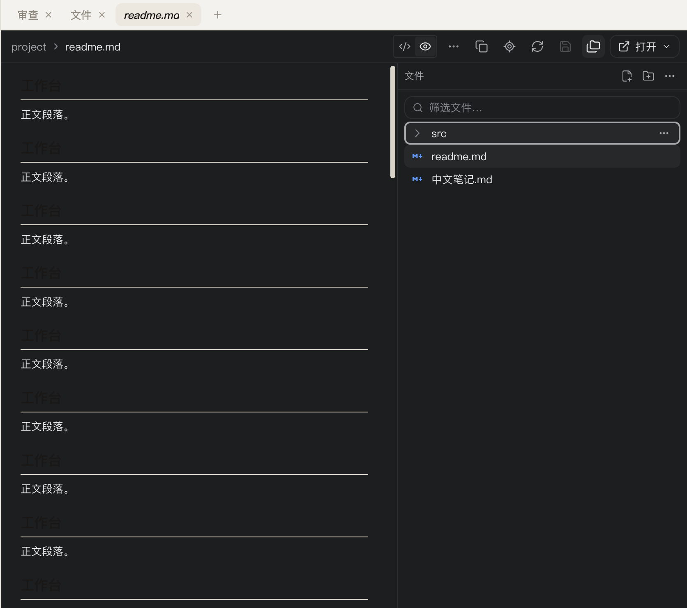
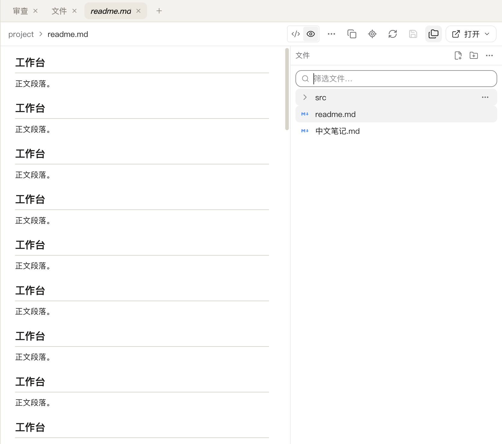
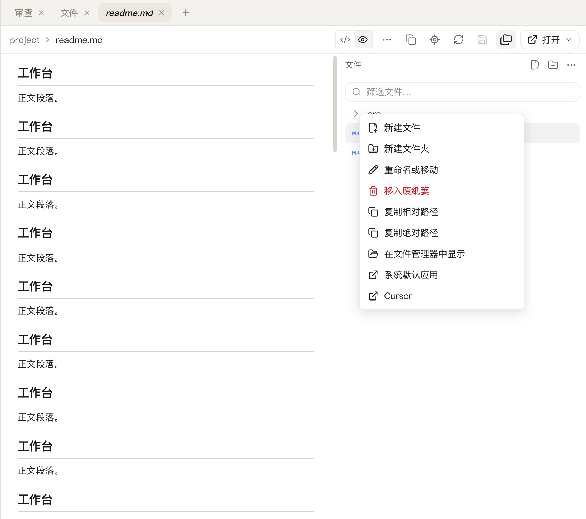

# FR-14：视觉与交互完整性

本阶段在 `.worktrees/file-review-workbench` / `codex/file-review-workbench` 完成 FR-14。另一任务使用的原工作区未修改、切换、重置或停止；分支整合仍待 FR-15。

## 交付行为与修复

- 新增状态核对脚本 `scripts/test-ui-review.mjs`（`pnpm test:ui-review`）：在参考图实测的视口与 DPR 下（files 820×785、review 836×740，DPR 2，浅色、简体中文），对**默认 / 展开 / 筛选 / 选中 / 菜单 / 窄面板**六个状态逐项截图并断言，另含深色映射、中英文、输入法、键盘与无障碍，共 **18 项**（两个面各 9 项）、**16 张**截图。全部断言走真实 Chromium 布局与原生指针/键盘输入，核对结构与尺寸预算，不做像素级叠图。
- 修复本轮发现的两个真实布局缺陷：
  1. **上下文列把面板挤出可视区**（FR-13 记录）：审查列里文件树按 `height: 100%` 占满整列，AI 审查面板/意见面板的底部操作被裁掉，鼠标点不到。改为「文件树吸收剩余高度、面板不收缩、面板内容自己滚动」，并加了面板预算断言（面板底部不越出列、面板内控件全部可达）。
  2. **窄窗内容区被挤到不可用**：窗口缩到 620px 时文件树仍保持 374px，内容区只剩 180px。给工作台加了 ResizeObserver：窗口变化时按 `可用宽度 − 260px` 收敛文件树宽度（下限 200px），窄窗下内容区仍有可用宽度；拖动调整宽度的既有行为不变。
- 工具栏在窄窗下按既有响应式规则换行（保证每个控件都在窗口内），其余状态下保持单行；状态核对同时断言「工具栏/内容区/上下文列无横向溢出」「所有可见控件在窗口内且非零尺寸」。
- 核对既有入口没有被新界面弄丢：脚本断言旧的 `FileDrawer` 抽屉未挂载（文件入口统一到工作台标签）；浏览器/终端/子会话标签、计划确认卡与 `/undo` 由既有烟测覆盖并已重跑（见下）。
- 深色映射：核对浅色基准（`data-color-scheme="light"` + 主题变量可用）与深色映射（切换属性后背景变量不同）；组件级 `setColorScheme` 的深色渲染由审查夹具烟测的最后阶段（dark + English 截图）覆盖。

## 验证

- `pnpm test:ui-review`：**18 项状态核对通过**，16 张截图写入 `docs/file-review-reference/fr-14-*.png`，renderer 无错误。[原始记录](file-review-reference/fr-14-result.json)。
- `pnpm test --reporter=dot --maxWorkers=1`、`pnpm typecheck`、`pnpm build`：全量用例、类型与构建通过。
- 既有回归重跑：`pnpm test:git-review`（37 阶段，含审查面默认/展开/选中/窄窗/深色英文截图）、`pnpm test:file-workbench`（7 阶段，含宽度/选中/滚动持久化）、`pnpm test:file-review`（5 阶段）、`node scripts/test-browser.mjs`（浏览器/终端/标签/工具栏/侧栏/报告/子会话/消息列表）、`TACODE_PREVIEW_SMOKE=1 node scripts/test-session-activity.mjs`（真实 App 文档，首次运行在滚动等待上抖动，重跑通过 159.8 ms）。
- **环境注意**：本轮换到另一台机器/系统版本（darwin 27.0.0，此前证据为 25.6.0）。`pnpm test:file-formats` 的大文件分块「上一段精确位置」阶段在当前环境稳定失败；把 `workbench.css` 回退到 HEAD 后同样失败（且更早），可确认**与本轮改动无关**，是环境敏感的既有阶段。FR-10 的通过状态与证据来自先前的 macOS 环境，此处如实记录不作修改。
- 参考图口径：本脚本的默认截图是「打开文档后的工作台默认态」，对应参考图 `files` 面；参考图 `review` 面（未暂存差异、变更字母树、范围栏）由 git-review 烟测的截图与 37 阶段断言覆盖，两者合起来构成六状态核对。

## 截图

## 边界和下一项

- 不做像素级叠图：断言覆盖结构、尺寸预算、状态与可交互性；参考图的图标级差异（如工具栏「···」溢出菜单、复制/分栏图标的具体位置）未逐一复刻，留待需要时按 FR-15 的最终视觉核对追加。
- 窄窗下工具栏换成两行是既有响应式约定（保证控件可达），不是参考图形态；如后续要求窄窗也保持单行，需要另立溢出菜单。
- 性能（2 万文件、4 MiB 文本、100 文件/5 万 diff 行）与 Windows 适配、分支整合属 FR-15；本阶段不改变主线整合状态。
- 专项 **14/15**；下一条 **FR-15：性能、Windows 与最终整合**（Windows 实机证据需具备 Windows 的环境）。完整目标保持 active，分支仍隔离且未合并。
